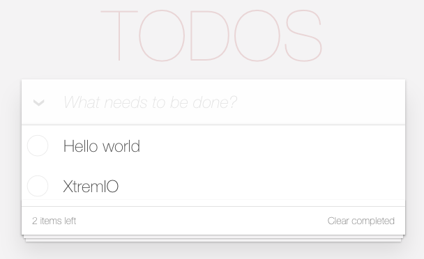

<!-- .slide: data-background="../images/title-slide.jpg" -->
<!-- .slide: id="events" -->
## Building Applications with Angular

# Handling Events

---

<!-- .slide: id="events-handling-events" -->
## Handling Events

- Bind an expression to any DOM event using `(event)="action"` in a tag
- `event` is what to handle
- `action` is what to do
  - Almost always a method call

---
<!-- .slide: id="events-adding-items-1" -->
## Adding Items to the List

- Create a button
- Have its `click` event call `addToDo` with a fixed string

#### _src/app/todo-list/todo-list.component.html_
```html
<ul>
  <li *ngFor="let item of thingsToDo">{{item}}</li>
</ul>
<button (click)="addToDo('make coffee')">make coffee</button>
```

---
<!-- .slide: id="events-adding-items-2" -->
## Adding Items to the List

- Create the corresponding method in the component class

#### _src/app/todo-list/todo-list.component.ts_
```ts
export class TodoListComponent implements OnInit {
  // ...
  
  addToDo(text: string) {
    this.thingsToDo.push(text);
  }
}
```

---
<!-- .slide: id="events-adding-specific-items-1" -->
## Adding Specific Items

- Add an `input` field
- Create a local variable *in the template* to hold its value using `#newItem`
  - `newItem` is *not* a member of the component class
- Modify the method call to pass that variable

#### _src/app/todo-list/todo-list.component.html_
```html
// ...
<p>
  <input #newItem placeholder="item"/>
  <button (click)="addToDo(newItem)">+</button>
</p>
```

---

<!-- .slide: id="events-adding-specific-items-2" -->
## Adding Specific Items

- `newItem` is a whole object, not just the text
- use `text.value` in `addToDo`
  - and then clear it to empty out the input box


#### _src/app/todo-list/todo-list.component.ts_
```ts
export class TodoListComponent implements OnInit {
  // ...

  addToDo(text: HTMLInputElement) {
    this.thingsToDo.push(text.value);
    text.value = '';
  }
}
```

---
<!-- .slide: id="events-reusable-components" -->
## Making a Reusable Component

- A text input with a button feels like something we could re-use
- Want to have:
  - Button with user-specified label
  - Text input field
  - *Some way to get the data into the parent*
- Have the component emit events
- Angular presents them in the same way as built-in events like `click`

---
<!-- .slide: id="events-component-skeleton" -->
## Create the Component Skeleton

- `ng generate component genericInput`

---
<!-- .slide: id="events-move-the-html" -->
## Move the HTML

#### _src/app/todo-list/todo-list.component.html_
```html
<ul>
  <li *ngFor="let item of thingsToDo">{{item}}</li>
</ul>
<app-generic-input></app-generic-input>
```

#### _src/app/generic-input/generic-input.component.html_
```html
<p>
  <input #newItem placeholder="item"/>
  <button (click)="addToDo(newItem)">+</button>
</p>
```

---
<!-- .slide: id="events-move-the-method" -->
## Move the Method

- Remove `addToDo` from `TodoListComponent`
- Put it in `GenericInputComponent`

#### _src/app/generic-input/generic-input.component.ts_
```ts
export class GenericInputComponent implements OnInit {
  // ...
  addToDo(text: HTMLInputElement) {
    this.thingsToDo.push(text.value);
    text.value = '';
  }
}
```

- Causes a compilation error because `GenericInputComponent` doesn't have `thingsToDo`

---
<!-- .slide: id="events-create-event-emitter-1" -->
## Create an Event Emitter

#### _src/app/generic-input/generic-input.component.ts_
```ts
@Component({ ... })
export class GenericInputComponent implements OnInit {
  // ...

  @Output() newItem = new EventEmitter<string>();

  addToDo(text: HTMLInputElement) {
    this.newItem.emit(text.value);
    text.value = '';
  }
}
```

---
<!-- .slide: id="events-create-event-emitter-2" -->
## A What?

- `EventEmitter` can send things to anyone who's listening
- `EventEmitter` is *generic*
  - Must provide an actual type for events as in `EventEmitter<string>`
- `GenericInputComponent` is now emitting events, but nobody is listening

---
<!-- .slide: id="events-refactor" -->
## Refactor the Main Application

1. Move `<app-generic-input>` to `app.component.html`
1. Add an event handler in `app.component.html`
   - Name is the name of the `@Output` member variable in `GenericInputComponent`

#### _src/app/app.component.html_
```html
<h1>{{title}}</h1>
<app-todo-list [thingsToDo]="thingsToDo"></app-todo-list>
<app-generic-input (newItem)="onNewItem($event)"></app-generic-input>
```

- The `onNewItem` event handler is a public method on the `AppComponent` class
- `$event` is a special Angular variable that represents the value emitted by the captured event
  - In our case, the string inputted by the user

---
<!-- .slide: id="events-connect-the-wires" -->
## Connect the Wires

#### _src/app/app.component.ts_
```ts
export class AppComponent {
  thingsToDo = [
    'Learn JavaScript',
    'Learn Angular'
  ];

  onNewItem(item: string) {
    this.thingsToDo.push(item);
  }
}
```

---

<!-- .slide: id="events-demo" -->
## Let's add events!


