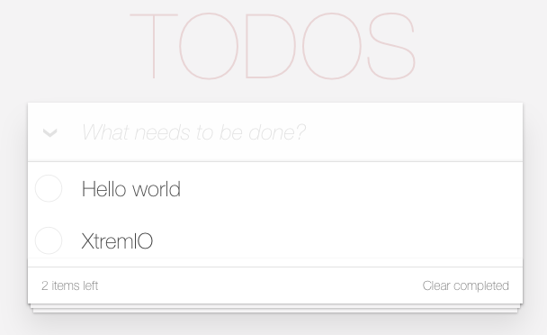

<!-- .slide: data-background="../images/title-slide.jpg" -->
<!-- .slide: id="services" -->
## Building Applications with Angular

# Services

---
<!-- .slide: id="services-what-is-a-service" -->
## What is a Service?

- Something that provides functionality to many components
  - Frequently implemented as a singleton
  - Database connection, HTTP, etc.
- Does not produce a view itself

---
<!-- .slide: id="services-creating-a-service" -->
## Creating a Service

- Use `ng generate service todo`
- Creates `src/app/todo.service.*`
  - Note: in the `src/app` directory
  - We could (and should) create a `services` directory

```
├── src
│   ├── app
│   │   ├── todo.service.spec.ts
│   │   └── todo.service.ts
```

---
<!-- .slide: id="services-whats-in-a-service" -->
## What's in a Service?

- A service is just a class decorated with `@Injectable`

#### _src/app/to-do.service.ts_
```ts
@Injectable()
export class TodoService {

  constructor() { }

}
```

---
<!-- .slide: id="services-registering-a-service-1" -->
## Registering a Service

- Services need to be registered before they can be used
- Angular CLI does this automatically for new components
- Must add the class name to the `providers` field in `src/app/app.module.ts`

---
<!-- .slide: id="services-registering-a-service-2" -->
## Registering a Service

#### _src/app/app.module.ts_
```ts
// ...other imports generated by Angular CLI...
import { ToDoService } from './to-do.service';

@NgModule({
  declarations: [
    AppComponent,
    ToDoListComponent,
    GenericInputComponent
  ],
  imports: [
    BrowserModule,
    FormsModule,
    HttpModule
  ],
  providers: [
    TodoService     // added
  ],
  bootstrap: [AppComponent]
})
```

---
<!-- .slide: id="services-getting-access-to-a-service" -->
## Getting Access to a Service

- Add a variable to the constructor with the type of the service
- Angular's *dependency injection* system will give the component access to an instance of that class
  - Angular's default behavior for dependencies is a singleton
  - `private` means that `toDoService` as a class property of `ToDoListComponent` can only be accessed within the component itself

#### _src/app/to-do-list/to-do-list.component.ts_
```ts
@Component({ ... })
export class TodoListComponent implements OnInit {

  @Input() thingsToDo: string[];

  constructor(private todoService: TodoService) { }

  ngOnInit() {
  }
}
```

---

<!-- .slide: id="services-demo" -->

## Let's rule 'em todos!


